**Vehicle Detection Project**

The goals / steps of this project are the following:

-   Perform a Histogram of Oriented Gradients (HOG) feature extraction on a labeled training set of images and train a classifier Linear SVM classifier
-   Optionally, you can also apply a color transform and append binned color features, as well as histograms of color, to your HOG feature vector.
-   Note: for those first two steps don't forget to normalize your features and randomize a selection for training and testing.
-   Implement a sliding-window technique and use your trained classifier to search for vehicles in images.
-   Run your pipeline on a video stream (start with the test\_video.mp4 and later implement on full project\_video.mp4) and create a heat map of recurring detections frame by frame to reject outliers and follow detected vehicles.
-   Estimate a bounding box for vehicles detected.

# [Rubric](<https://review.udacity.com/#!/rubrics/513/view>) Points

Here I will consider the rubric points individually and describe how I addressed each point in my implementation.  

## Histogram of Oriented Gradients (HOG)

The first step in the project is to define proper features to help to build vehicle detection system. 
The approach of defining the proper features is to use HOG (Histogram of Oriented Gradients) 

### Explain how (and identify where in your code) you extracted HOG features from the training images.

The code for this step is the following code blocks. The full source code can be found at the [utils.py](./utils.py)

1.  get\_hog\_features

    `get_hog_features`:
    
        from skimage.feature import hog
        def get_hog_features(img, orient, pix_per_cell, cell_per_block, 
                             vis=False, feature_vec=True):
            """
            Given a one channel img, calculate its HOG feature.
            """
            # Call with two outputs if vis==True
            if vis == True:
                features, hog_image = hog(img, orientations=orient, 
                                          pixels_per_cell=(pix_per_cell, pix_per_cell),
                                          cells_per_block=(cell_per_block, cell_per_block), 
                                          transform_sqrt=False, 
                                          visualise=vis, feature_vector=feature_vec)
                return features, hog_image
            # Otherwise call with one output
            else:      
                features = hog(img, orientations=orient, 
                               pixels_per_cell=(pix_per_cell, pix_per_cell),
                               cells_per_block=(cell_per_block, cell_per_block), 
                               transform_sqrt=False, 
                               visualise=vis, feature_vector=feature_vec)
                return features

2.  get\_hog\_features\_channels

    `get_hog_features_channels`:
    
        def get_hog_features_channels(img, orientation, pix_per_cell, cell_per_block, channels):
            """
            Given a list of color channels, compute the HGO features for each of the channels, and
            concatenate the features horizontally.
            """
            hog_features = np.hstack(tuple(get_hog_features(
                img[:,:,i], orientation, pix_per_cell, cell_per_block, feature_vec=False).ravel()
                                           for i in channels))
            return hog_features

3.  Samples of cars and non-cars

    I started by reading in all the \`vehicle\` and \`non-vehicle\` images.  Here is some examples of of the \`vehicle\` and \`non-vehicle\` classes 
    (the odd number rows are vehicles, and even number rows are non-vehicles):
    
    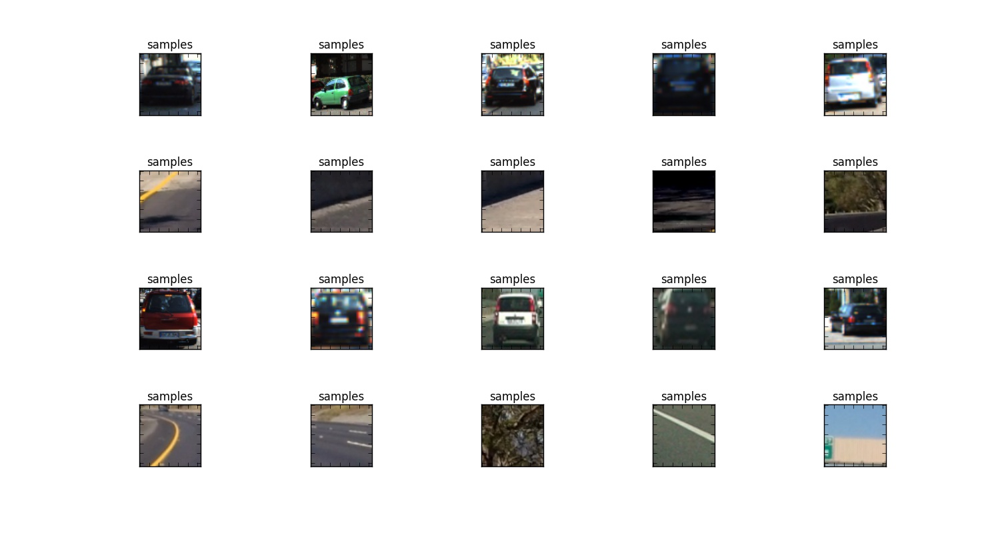
    
    I collected all samples from the vehicle folder of those from GTI, and KITTI, and also randomly shuffled
    the samples. By the random sampling, it seems that there is lacking of side view of vehicles. 
    The observation is further confirmed by the subsequent experiments that it's much harder to recognize
    vehicles at other lane at the distance, when they are viewed from side. 
    
    This may be an area of improvement to collect more samples of vehicles' side views. 

4.  Exploration of other features and combinations

    I then explored different color spaces and different \`skimage.hog()\` parameters (\`orientations\`, \`pixels\_per\_cell\`, and \`cells\_per\_block\`).  
    
    I grabbed random images from each of the two classes and displayed them to get a feel for what the \`skimage.hog()\` output looks like.
    
    Here are examples of using the \`YCrCb\` color space and HOG parameters of \`orientations=18\`, \`pixels\_per\_cell=(8, 8)\` and \`cells\_per\_block=(3, 3)\`:
    
    1.  HOG with YCrCB Y channel
    
        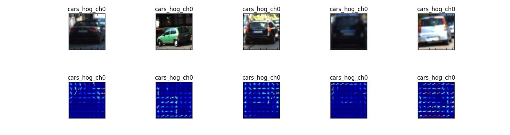
        
        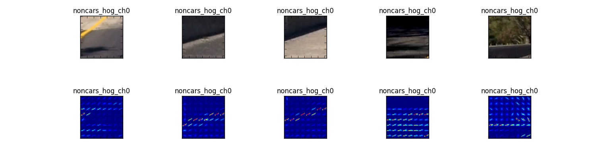
        
        With YCrCB channel Y, there are indeed some clear pattern of edges for cars, while for non-cars, 
        the pattern tends to be simpler, except to those with trees, shades, etc. 
    
    2.  HOG with YCrCb Cr channel
    
        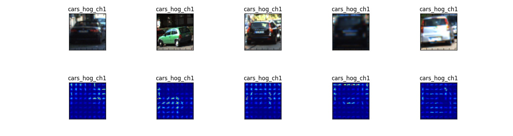
        
        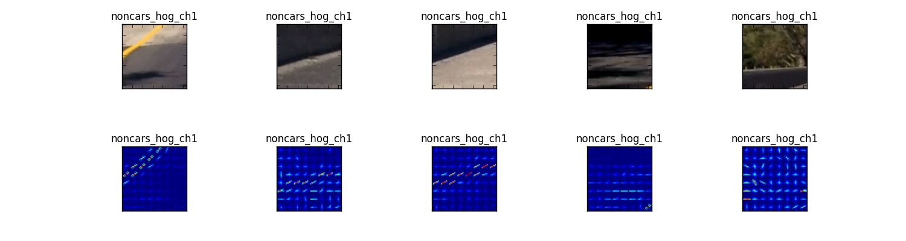
        
        At the YCrCB channel Cr, there are similar clear pattern of edges for cars, while for non-cars, 
        the pattern tends to be simpler, except to those with trees, shades, etc. The gradient activity 
        for cars are less active than those at channel Y. 
    
    3.  HOG with YCrCb Cb channel
    
        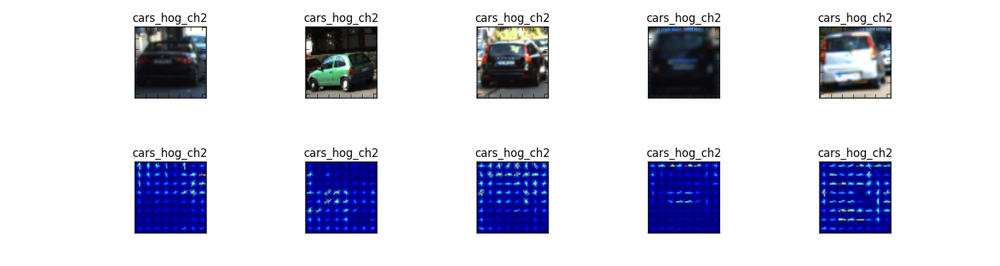
        
        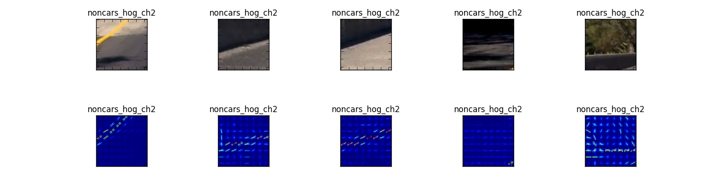
        
        Again, the patterns are similar to those of channel Cr. 
    
    4.  Feature of Spatial Compaction
    
        Here are some examples of spatial compaction with spatial compaction dimension 16x16. 
        
        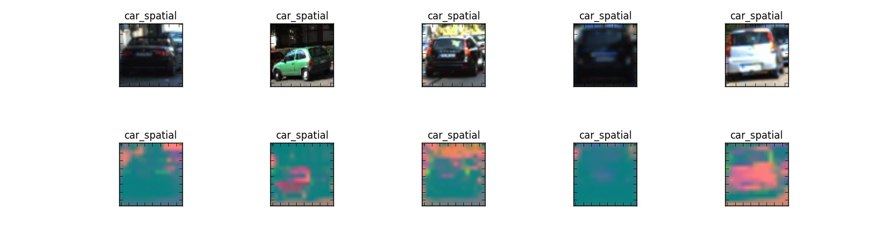
        
        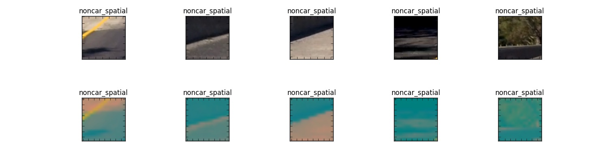
        
        For naked eyes, it's not conclusive whether or how the features would help for car detection. 
        It might help for detection, as after the compression, 
        only the most prominent features remain. 
    
    5.  Feature of Color Histogram
    
        Here are some color histogram of all the channels concatenated:
        
        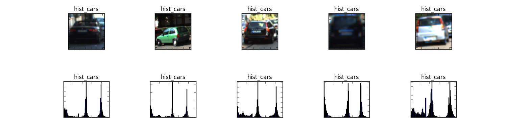
        
        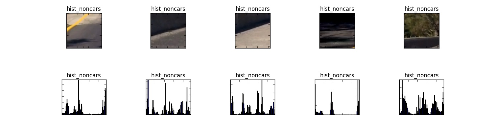
        
        Like the feature of HOG at the Y channel, there is distinct pattern of cars, that almost at the 
        very close bins, there are three peaks. For non-cars, the peaks would not have such fixed patterns. 
        
        This would be a great pattern to be exploited by convolution along the 
        histogram feature vector. This might be a potential direction for further research. 
        
        Of course, I have not studied the histogram enough. The observation is not conclusive. 

### Explain how you settled on your final choice of HOG parameters.

I tried various combinations of parameters. 
I developed the intuition that HOG features probably is more helpful, the color histogram may also help, the spatial feature might in certain situation.
I also observed that color system of YCrCb and HLS may provide better feature extraction in terms of SVC validation accuracy. 

Although, some channels might help more. At the moment, due to limited time, I decide to use all channels. As I had the impression that Support Vector Machine does not have 
much problems to handle additional feature parameters. This will be an area of optimization though. 

Below are the hyper-parameters that I settled down after my exploration:

`parameters_identification`:

    ident_config = {}                            # The map for configuration to identify cars
    ident_config['C_SVM'] = 0.75                  # the regularization coefficient, the smaller, the more regularization
    ident_config['cells_per_block'] = 3          # the number of cells per block dimension for HOG, change from 2
    ident_config['color_space'] = "YCrCb"        # the color space for feature detection, the other good candidate is HLS, "YCrCb"
    ident_config['default_color_space'] = "RGB"  # the default color space, due to reading from mpimg.imread
    ident_config['hist_bins'] = 32               # the number of bins for color histogram feature, change from 32, 48
    ident_config['orientation'] = 18             # the orientation numbers for HOG, change from 9
    ident_config['pix_per_cell'] = 8             # the numbers of pixels per cell dimension for HOG, change from 8
    ident_config['sample_window'] = 64           # the size of sample window size, change from 64  
    ident_config['scale'] = 1.6                  # the scaling factor for feature extraction, changed from 1.5, 2.0 getting better
    ident_config['spatial_size'] = 16            # the number of dimensions for spatial feature, changed from 16, 24
    ident_config['v_start'] = 413                # the vertical coordinate to start search for cars
    ident_config['v_stop'] = 720-220             # the vertical coordinate to stop search for cars
    ident_config['channels'] = '[0, 1, 2]'       # the list of color channels in string formaty

### Describe how (and identify where in your code) you trained a classifier using your selected HOG features (and color features if you used them).

I trained a linear SVM using the follow code segments:

1.  Prepare and organize feature data

    First, I sort all image paths into car and non-cars. 
    Also shuffle the sequence of the elements. 
    
    `sort-samples`:
    
        import matplotlib.image as mpimg
        import numpy as np
        import matplotlib.pyplot as plt
        import cv2
        import os.path
        def samples_sorted():
            """
            returns the paths of the sample images for cars and non-cars,
            including duplication of some samples.
            """
        
            import glob
            cars_original = glob.glob("./vehicles/*/*.png")
            # The following are duplicated:
            cars_KITTI = glob.glob("./vehicles/KITTI_extracted/*.png")
            cars_GTI_Right = glob.glob("./vehicles/GTI_Right/*.png")
            cars_GTI_Left = glob.glob("./vehicles/GTI_Left/*.png")
            cars = cars_original + cars_KITTI + cars_GTI_Left + cars_GTI_Right
            # The above introduces duplication of samples, causing bleeding of training samples into validation
            np.random.shuffle(cars)     # side effect return None
            cars_to_be_augmented = cars_GTI_Left + cars_GTI_Right
            np.random.shuffle(cars_to_be_augmented)
            num_cars = len(cars) + len(cars_to_be_augmented)
        
            non_cars_original = glob.glob("./non-vehicles/*/*.png")
            # The following are duplicated:
            non_cars_Extras = glob.glob("./non-vehicles/Extras/*.png")
            noncars = non_cars_original + non_cars_Extras + non_cars_Extras
            # The above introduces duplication of samples, causing bleeding of training samples into validation
            np.random.shuffle(noncars)  # side effect return None
            num_noncars = len(noncars)
            return cars, noncars, cars_to_be_augmented, num_cars, num_noncars
    
    In order to enhance the sample population of cars with side views. I duplicated the samples from GTI\_Left, GTI\_Right, and KITTI. 
    To balance with the addition of cars' samples, I also duplicated the samples of non-cars, from folder Extra. 
    
    The return value of "cars\_to\_be\_augmented" are of those cars of left/right views. They will be further augmented in the feature extraction stage. 
    
    Note, this approach has negative impact of causing "bleeding" of samples between training and validation, as some identical samples would appear in both training and validation. 
    This is an improvement that I should do when I have more time. I only added the duplication after my exploration of feature extraction, thus it does not have material harm. 
    
    Next, extract the features from the images. The feature extracted should be consistent with that for prediction in terms of value range.
    
    `training_featur`:
    
        import utils
        from sklearn.preprocessing import StandardScaler
        from sklearn.model_selection import train_test_split
        #from sklearn.cross_validation import train_test_split
        
        def training_features(orientation=8, pix_per_cell=8, cell_per_block=2,
                              spatial_size=16, hist_bins=32, color_space='HLS', sample_window=64,
                              channels=[0], debug=False):
            """
            from the file paths of cars, and noncars
            extract features and labels for training and validation.
            """
            def extract(paths, augment=False):         # extract and augment
                features = []
                for file in paths:
                    image = utils.imread_scaled_unified(file)
                    if color_space != ident_config['default_color_space']:
                        image_color_converted = cv2.cvtColor(
                            image,
                            eval('cv2.COLOR_' + ident_config['default_color_space'] + '2' + color_space))
                    else:
                        image_color_converted = image
                    # End of if color_space
        
                    image_resized = cv2.resize(image_color_converted, (sample_window, sample_window))
                    if augment:
                        brightened = utils.brighten(image_resized, bright=1.2)
                        flipped = cv2.flip(utils.brighten(image_resized, bright=1.1), 1)  # horizontal flip
                        to_process = [brightened, flipped]
                    else:
                        to_process = [image_resized]
                    # End of if augment
        
                    for x in to_process: # must use square bracket for single element in list to iterate
                        # using tuple, it will iterate the single image's row dimension. 
                        hog_features = utils.get_hog_features_channels(
                            x, orientation, pix_per_cell, cell_per_block, channels)
                        spatial_features, hist_features = utils.color_features(
                            x, spatial_size=spatial_size, hist_bins=hist_bins, channels=channels)
                        image_features = np.hstack(
                            (spatial_features, hist_features, hog_features)).reshape(1, -1)
                        image_features = np.squeeze(image_features)
                        # remove the redundant dimension, StandardScaler does not like it
                        features.append(image_features)
                    # End of for x ...
                # End of for file
                return features
            cars, noncars, cars_to_be_augmented, num_cars, num_noncars = samples_sorted()
            num_samples = 30000         # limit the number of samples to be selected from each group.
            print('num_cars: ', num_cars, ' num_noncars: ', num_noncars, ' max. samples: ', 3*num_samples)
        
            car_features = extract(cars[:min(num_samples, len(cars))], augment=False)
            car_augmented_features = extract(cars_to_be_augmented[:min(num_samples, len(cars_to_be_augmented))], augment=True)
            noncar_features = extract(noncars[:min(num_samples, len(noncars))], augment=False)
        
            # Create an array stack of feature vectors
            X = np.vstack((car_features, car_augmented_features, noncar_features)).astype(np.float64)
            # Fit a per-column scaler
            X_scaler = StandardScaler().fit(X)
            # Apply the scaler to X
            scaled_X = X_scaler.transform(X)
            del X                       # X, scaled_X consumes much memory, should be released ASAP.
            # Define the labels vector
            y = np.hstack((np.ones(len(car_features) + len(car_augmented_features)), np.zeros(len(noncar_features))))
        
            # Split up data into randomized training and test sets
            rand_state = np.random.randint(0, 100)
            X_train, X_test, y_train, y_test = train_test_split(
                scaled_X, y, test_size=0.1, random_state=rand_state)
            return X_train, X_test, y_train, y_test, X_scaler
    
    The number of samples of cars is about 20K, of non-cars, 19K. 
      They are about equal, an OK balance. 
    
    Besides extracting the features of HOG, spatial, color-histogram. I also perform augmentation to those samples with left/right side views in terms of 
    adjusting the brightness, and also perform the horizontal flip, effectively, add another two times those samples of side views. 
    
    Then, the all extracted features are normalized column-wise, that is, per feature wise. 
    
    Finally, the feature vectors and their corresponding labels are split for training and validation. 
    Again, there is a problem in not clean sepeartion of traing and validation samples. 
    
    At the later stage of the experiment, I decided to use only 10% for validation, in order to reduce the false positive issue in car detection. 

2.  Train SVC

    Here is the high-level control of the training: 
    All the other supporting code can be found at [train.py](./train.py) and [utils.py](./utils.py)
    
    `train-svc`:
    
        import time
        from sklearn.svm import LinearSVC
        from ident_config import ident_config
        
        def train_svc(X_train, X_test, y_train, y_test):
            # Use a linear SVC 
            svc = LinearSVC(C=ident_config['C_SVM'])
            # Check the training time for the SVC
            t=time.time()
            num_samples = 50000
            svc.fit(X_train[:min(num_samples, y_train.size)], y_train[:min(num_samples, y_train.size)])
            t2 = time.time()
            print(round(t2-t, 2), 'Seconds to train SVC...')
            # Check the score of the SVC
            test_accuracy = round(svc.score(X_test, y_test), 4)
            print('Test Accuracy of SVC = ', test_accuracy)
            train_accuracy = round(svc.score(X_train, y_train), 4)
            print('Train Accuracy of SVC = ', train_accuracy)
            # Check the prediction time for a single sample
            t=time.time()
            n_predict = 10
            print('SVC predicts for testing samples:\t', svc.predict(X_test[0:n_predict]))
            print('For these', n_predict, 'labels:\t\t\t', y_test[0:n_predict])
            t2 = time.time()
            print(round(t2-t, 5), 'Seconds to predict', n_predict,'labels with SVC')
        
            print('SVC predicts for training samples:\t', svc.predict(X_train[0:n_predict]))
            print('For these', n_predict, 'labels:\t\t\t', y_train[0:n_predict])
        
            return svc, test_accuracy
    
    The validation accuracy is in the range of 98.5% to 99.02%. Which seems very high, but what matter is the recognition performance in real picture. 

## Sliding Window Search

### Describe how (and identify where in your code) you implemented a sliding window search.  How did you decide what scales to search and how much to overlap windows?

Upon experiment, and based on the intuition that the objects (cars) appear smaller, the further away from the camera, I partition the image vertically into sections overlapping
with height gradually reducing. 
I found that the width reduction should be less, the further distance, the view of car's side view, it actually would not reduce, but even increase. 

Furthermore, most of the vehicles would only appear with high probability at a few sections. I define overlapping parameter per section, 
and define high overlapping for those section with car concentration. 

Here is an illustration of the sliding windows generated:

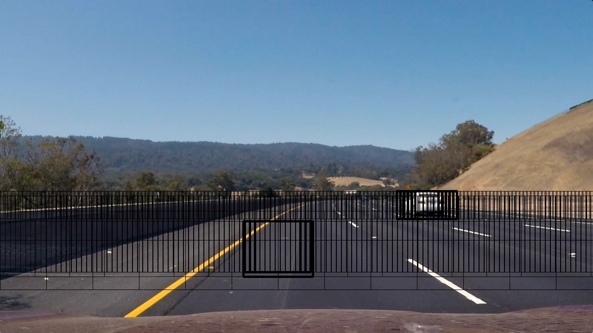

Here is the code defining the sliding windows:

1.  Generating sliding windows

    Only the sections below the horizon, and in front of the camera would have cars appearing. This would be the 
    focused area for sliding windows. 
    
    For the focused area, generate sliding windows in terms of relative coordinates to the focused area, of the top left, 
    and bottom right corners. 
    
    The size of the sliding windows will be conditional to the vertical positions of the windows, the higher, the smaller, 
    to match the size of the cars in that position. 
    With the adaptive window size, it seems that the scale in find\_cars may not be needed. as the window size will be adjusted
    anyway, not through scale though. 
    
    The generation of the window list can be done only once. 
    The generated window list can be stored for reference for each frame's processing. 
    
    `sliding_windows`:
    
        def slide_windows(focused_width, focused_height, h_overlap = 0.3, v_overlap = 0.3):
            """
            Returns a list of bounding box coordinates, relative to the focused_image_area,
            defined by the focused_width, and focused_height.
            """
            rate = 1/2                  # used to specify the window sections
            window_specification_per_v_position = [  # list of window specifications, as a list of
                # the window width, the window height, the application section specifications:
                # the vertical window start, vertical window end, and
                # the horizontal window start, window horizontal end
                # all the coordinates are relative to the focused_image_area
        
                [200, 170, int(focused_height*rate), focused_height,  # from focused_height*(1/2) to focused_height # 240, 160
                 0, focused_width, 0.5, 0.3], # lower
                [150, 120, int(focused_height*rate*6 / 4), focused_height-int(focused_height*rate*rate*rate),  # 150, 120
                 0, focused_width, 0.5, 0.3], # lower-middle
                [120, 110, int(focused_height*rate*6 / 4), focused_height-int(focused_height*rate*rate), # 120, 110
                 0, focused_width, 0.9, 0.3], # middle
                [120, 96, int(focused_height*rate*rate*rate), focused_height-int(focused_height*rate), # 120, 96
                 0, focused_width, 0.9, 0.3], # upper-middle
                [90, 60, 0, int(focused_height*rate*rate), # 90, 60 # original: 84, 64, need to enlarge to 90, and 60 to catch the side view cars
                 0, focused_width, 0.9, 0.3] # top
            ]
            window_list = []
            for window_specification in window_specification_per_v_position:
                h_window_size, v_window_size, v_window_start, v_window_stop, h_window_start, h_window_stop, h_overlap, v_overlap = window_specification
                # The number of pixels shift in horizontal or vertical for sliding windows
                nh_pix_per_step = np.int(h_window_size*(1 - h_overlap))
                nv_pix_per_step = np.int(v_window_size*(1 - v_overlap))
        
                # number of sliding windows in horizontal or vertical direction:
                nh_windows = max(1, np.int((h_window_stop - h_window_start) / nh_pix_per_step))
                # at least one scanned window
                nv_windows = max(1, np.int((v_window_stop - v_window_start) / nv_pix_per_step))
                assert ((0 < nh_windows) and (0 < nv_windows)), (window_specification, nh_windows, nv_windows, "Zero number of window!")
                for vertical_index in range(nv_windows):
                    for horizontal_index in range(nh_windows):
                        start_h = horizontal_index * nh_pix_per_step + h_window_start
                        end_h = start_h + h_window_size
                        start_v = vertical_index * nv_pix_per_step + v_window_start
                        end_v = start_v + v_window_size
                        window_list.append(((start_h, start_v), (end_h, end_v)))
            return window_list
    
    Here is the code of finding the bounding boxes using the sliding windows:

2.  find\_cars

    `find_cars`:
    
        import utils
        from sklearn.preprocessing import StandardScaler
        def find_cars(img, svc, X_scaler, focused_vertical_start=400, focused_vertical_end=640,
                      orientation=8, pix_per_cell=8, cell_per_block=2,
                      spatial_size=16, hist_bins=32, color_space='HLS', sample_window=64,
                      channels=[0], sliding_windows=None,
                      debug=False, fname=None, frame_index=None):
            # Must have the normalization, otherwise, there will be excessive false positive. 
            img = img.astype(np.float32)/255  # this normalization turned out to be very needed
            # for accuracy, and generalization
        
            img_tosearch = img[focused_vertical_start:focused_vertical_end,:,:] 
            # only focus on the region of possibilities
            if sliding_windows is None:
                sliding_windows = slide_windows(img_tosearch.shape[1], img_tosearch.shape[0],
                                                h_overlap=0.9, v_overlap=0.5)
            # End of if len(sliding_windows)
        
            if color_space != ident_config['default_color_space']:
                ctrans_tosearch = cv2.cvtColor(
                    img_tosearch,
                    eval('cv2.COLOR_' + ident_config['default_color_space'] + '2' + color_space))
            else:
                ctrans_tosearch = img_tosearch
            # End of if color_space
            bboxes = []
            draw_img = np.copy(img)
            frame_index = frame_index or 0
            for window in sliding_windows:
                ((start_h, start_v), (end_h, end_v)) = window
                # Extract the image patch
                subimg = cv2.resize(
                    ctrans_tosearch[start_v:end_v, start_h:end_h], (sample_window, sample_window))
                # Get color features
                spatial_features, hist_features = utils.color_features(
                    subimg, spatial_size=spatial_size, hist_bins=hist_bins, channels=channels)
                hog_features= utils.get_hog_features_channels(
                    subimg, orientation, pix_per_cell, cell_per_block, channels)
                # Scale features and make a prediction
                test_features = np.hstack((spatial_features, hist_features, hog_features))
                # test_features = hog_features
                test_features = test_features.reshape(1, -1)
                test_features = X_scaler.transform(test_features)
                test_prediction = svc.predict(test_features)
        
                focused_horizontal_start = 0
                confidence = svc.decision_function(test_features)[0]
                if (debug and frame_index < 0) or ((test_prediction == 1) and (0.3 < confidence)):
                    top_left = (start_h + focused_horizontal_start, start_v + focused_vertical_start)
                    bottom_right = (end_h + focused_horizontal_start, end_v + focused_vertical_start)
                    box_color = (0,0,255) if (test_prediction==1) else (200, 200, 0)
                    line_width = 3 if (test_prediction==1) else 1
                    cv2.rectangle(draw_img, top_left, bottom_right, (0, 0, 255), line_width)
                    if debug:
                        mpimg.imsave('./output_images/boxed_' + str(frame_index) + '_' + utils.image_capture_name(fname), draw_img)
                    # End of debug
        
                    if ((test_prediction == 1) and (0.3 < confidence)):
                        bboxes.append((top_left, bottom_right))
                    # End of if ((test_prediction == 1) and (0.3 < confidence))
        
                # End of if (debug and frame_index < 10) or ((test_prediction == 1) and (0.3 < confidence))
            # End of for window in sliding_windows
            return bboxes, draw_img, sliding_windows
    
    The complete code for the processing pipeline is at [pipeline.py](./pipeline.py)

### Show some examples of test images to demonstrate how your pipeline is working.  What did you do to optimize the performance of your classifier?

Ultimately I searched on five sections using YCrCb 3-channel HOG features plus spatially binned color and histograms of color in the feature vector, 
which provided a OK result.  Here are some example images:

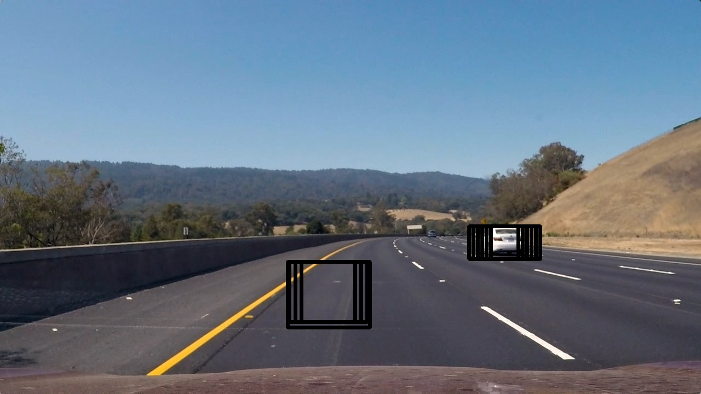

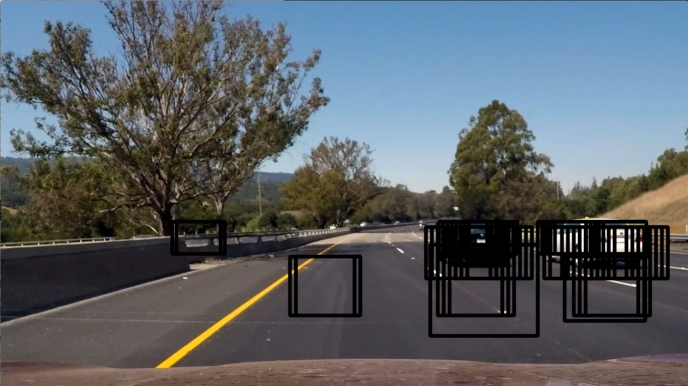

## Video Implementation

### Provide a link to your final video output.  Your pipeline should perform reasonably well on the entire project video (somewhat wobbly or unstable bounding boxes are ok as long as you are identifying the vehicles most of the time with minimal false positives.)

Here's a link to my video result:

<https://youtu.be/LBMsry0xjSA>

### Describe how (and identify where in your code) you implemented some kind of filter for false positives and some method for combining overlapping bounding boxes.

I recorded the positions of positive detections in each frame of the video.  From the positive detections of the current detection, and the detection of the past frames, 
I created a heatmap and then thresholded that map to identify vehicle positions.  

The use of past history of detection helps to smooth the detection. I use four frames of history, and at each iteration, I shift the memory one frame backward to phase out old memories. 

I then used \`scipy.ndimage.measurements.label()\` to identify individual blobs in the heatmap.  
I then assumed each blob corresponded to a vehicle.  I constructed bounding boxes to cover the area of each blob detected.  

1.  Visualize bounding boxes

    Here is the code segments for forming blob for vehicles:
    
    With bounding boxes identified, 
    and with bounding boxes from the previous frames, produce the final visualization of the cars identified. 
    
    `show_cars`:
    
        import matplotlib.image as mpimg
        import numpy as np
        import matplotlib.pyplot as plt
        import cv2
        import os.path
        from scipy.ndimage.measurements import label
        def compute_heatmap(initial_heatmap, bboxes, history, threshold=6):
            heatmap_accumulated = []
            heatmap = initial_heatmap
            for i in range(len(history)):
                if history[i]:
                    heatmap = add_heat(heatmap, history[i], value=(2 if (i < 2) else 1))
                # End of if history...
                heatmap_accumulated.append(heatmap)
            # End of for i in range(len(history))...
            if bboxes:
                heatmap = add_heat(heatmap, bboxes, value = 2)
            # End of if bboxes
            heatmap_accumulated[0] = heatmap
        
            heatmap, accumulated = apply_threshold(heatmap, threshold=threshold)
            return heatmap, heatmap_accumulated          # the heatmmap can be used for label
        
        def shift_history(history, recent_bboxes):
            for i in range(len(history)-1, 0, -1):  # reverse
                history[i] = history[i-1]
            # End of for in ...
            history[0] = recent_bboxes
            return history
        from utils import image_capture_name
        
        def show_cars(img, bboxes, history=None, threshold=1, debug=False, fname=None, frame_index=None):
            initial_heatmap = np.zeros_like(img[:,:,0])
            heatmap, heatmap_accumulated = compute_heatmap(initial_heatmap, bboxes, history, threshold=threshold)
        
            # Find final boxes from heat using label function
            labels = label(heatmap)
            draw_img, derived_bboxes = draw_labeled_bboxes(np.copy(img), labels, heatmap_threshold=heatmap)
            # to show the nonzero min, maximum in heatmap
            history = shift_history(history, derived_bboxes)
            frame_index = frame_index or 0
        
            if debug and frame_index < 0: # True and 0 < np.max(heatmap):
                fig = plt.figure()
                plt.subplot(131)
                plt.imshow(draw_img)
                plt.title('Car Positions')
                plt.subplot(132)
                plt.imshow(heatmap, cmap='hot')
                plt.title('Heat Map')
                fig.tight_layout()
                fig.savefig("./output_images/cars_" + str(frame_index) + "_" + image_capture_name(fname))
                plt.show()
                plt.close()
            # End of if debug
            if debug and frame_index == 23:
                # print out history heatmaps
                num_heatmaps = len(history)
                num = num_heatmaps + 2
                import matplotlib.gridspec as gridspec
                columns = 1; rows = num // columns
                figure = plt.figure(figsize=(columns*4, rows*2))
                gs1 = gridspec.GridSpec(rows, columns)
                gs1.update(wspace=0.9, hspace=0.9) # set the spacing between axes.
                row_height = 2; columns_width = 3
                for j in range(rows):
                    ax1 = plt.subplot(gs1[j, 0])
                    ax1.set_xticklabels([]); ax1.set_yticklabels([])
                    ax1.set_aspect('equal')
                    if j < rows - 2:
                        title = "History Heatmap Accumulated at -" + str(rows - j) + "th Detection"
                        plt.imshow(heatmap_accumulated[j], cmap='hot')
                    elif j == rows - 2:
                        title = "Current Heatmap"
                        plt.imshow(heatmap, cmap='hot')
                    else:
                        title = "Current Vehicle Dectection"
                        plt.imshow(draw_img)
                    # End of if j < row - 2
                    ax1.set_title(title)
                # End of for j in range(rows)
                figure.savefig(
                    "./output_images/history_heatmap" + str(frame_index) + "_" + image_capture_name(fname) )
                plt.show()
                plt.close()
            # End of if debug and frame_index == 9
            return draw_img, history, derived_bboxes
    
    Here's an example result showing the heatmap from a series of frames of video, the result of \`scipy.ndimage.measurements.label()\` and the bounding boxes then overlaid on the last frame of video:
    
    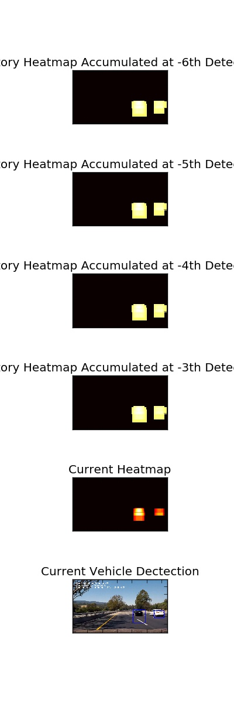

## Discussion

### Briefly discuss any problems / issues you faced in your implementation of this project.  Where will your pipeline likely fail?  What could you do to make it more robust?

This project involves at least three critical techniques to ensure successful vehicle detection. 

-   Feature definition and extraction
-   Sliding windows
-   False positive treatment and smoothing of the detection. 
    
    The feature definitions turned out to be more or less straight forward. The linear SVC can achieve rather high validation accuracy with the samples.

However, the samples are rather limited that they are very similar to the training samples.  

Plotting out the feature visualization helped to understand what might work for vehicle detection. 

It's the tuning of sliding windows or the surprise of required extremely high overlapping rate of sliding windows that was very challenge. Even with rather high validation 
accuracy, the vehicle detection would only work with sliding window capturing the vehicle in the right position in the picture. This challenge might be reduced to have more training examples 
with vehicles in different position in the picture. Convolution neural network might help also to make the recognition less rigid to the position of the vehicles in the sliding windows. 

  The false positive treatment and smoothing of the detection was a challenging to me as I was trying to implement a simpler algorithm with heat counters
with a decay mechanism of the heat counters. But it's difficult to tune the parameters of decay, and threshold. 
To meet the deadline, I had to implement a more conventional accumulation of past heatmap. 
I still feel that my algorithm would be much efficient. I'll take some time in the future to 
improve on the study. 

It still remains a challenge to tune the hyper-parameters of threshold, and sliding windows. More consideration would be needed to reduce the need to tune the parameters. 

  There is also two area that I made mistakes: the consistent data range and color space format, between the training and recalling. I had converted to image of png format, 
which is read by mpimg.imread as 
  value in the range of [0, 1], to the range of [0, 255], while in find\_cars, I had adopted the code to convert the read \*.jpg format, which already had value in the range of [0, 255] 
  to [0, 1]. This might have caused less accurate vehicle detection.

I also made mistake of forgetting to implement the color space conversion for the features for training. It had caused poorer accuracy, and more false positive, and false negative. 

All the above mistakes, cause much waste of time in tuning the subsequent hyper parameters. 

It remains a challenge to ensure the correctness in implementation of the algorithms, and research ideas. 

In summary, it's great learning experience to know the practice, and the challenges approaches. 

